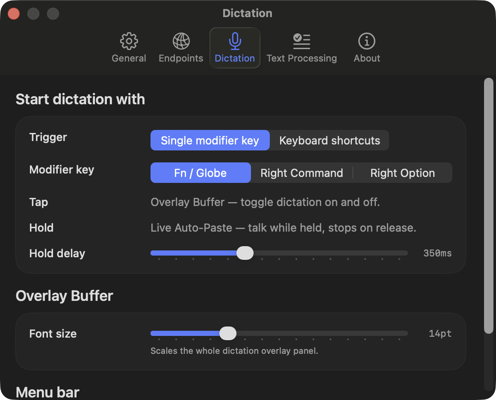
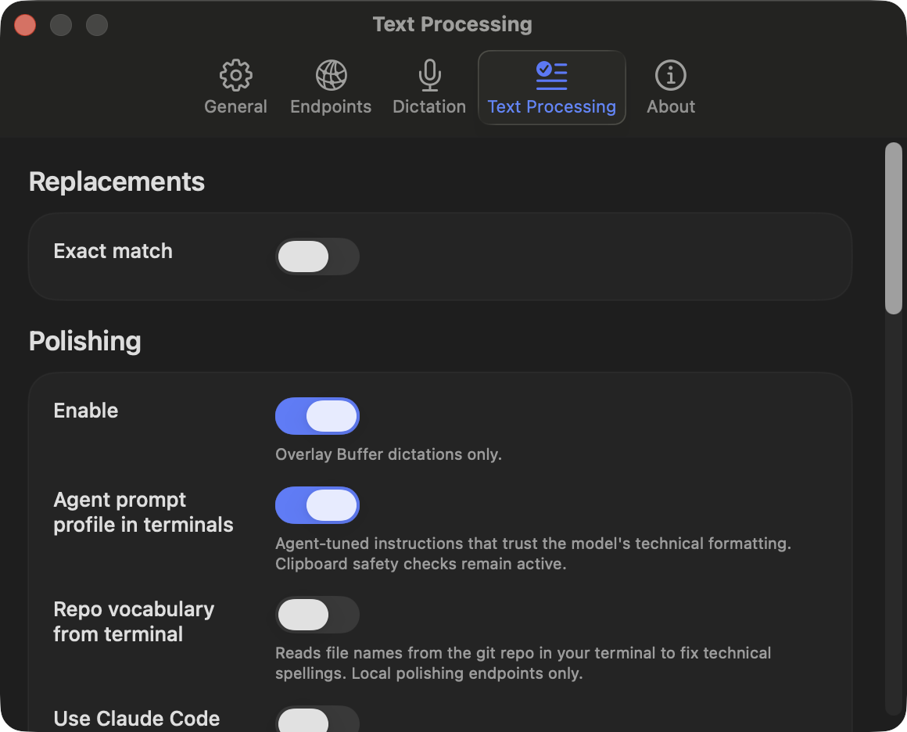

# localvoxtral

<p align="center">
  
</p>

<p align="center">
  
</p>

localvoxtral is a native macOS menu bar app for realtime dictation.
It keeps the loop simple: start dictation, speak, get text fast.
Unlike Whisper-based tools that transcribe after you stop speaking, Voxtral Realtime streams text as audio arrives, so words appear while you're still talking.
On Apple Silicon, `localvoxtral` + `voxmlx` + `mlx-lm` provides a fully local path (audio + inference + LLM polishing stay on-device), improving privacy and avoiding API costs.

It connects to any OpenAI Realtime-compatible endpoint. Recommended backends are `voxmlx` (Apple Silicon) and `vLLM` (NVIDIA GPU).
LLM Polishing connect to any OpenAI /chat/completions endpoint. The recommended backend is `mlx-lm` (Apple Silicon).

Built for Mistral AI's [Voxtral Mini 4B Realtime](https://huggingface.co/mistralai/Voxtral-Mini-4B-Realtime-2602) model, but it works with any OpenAI-compatible Realtime API backend and model.

## Features

- Global shortcut with selectable behavior: `Toggle` (press-to-start/stop) or `Push to Talk` (hold-to-dictate)
- Native menu bar app with instant open and visual feedback with the icon
- Output modes: overlay buffer (commit on stop) or live auto-paste into focused input
- Personal replacement dictionary (exact match or exact match + LLM-aware-replacement)
- Editable LLM system and user prompt templates
- Fully local dictation option with `voxmlx` (no third-party API traffic)
- Fully local LLM polishing option with `mlx-lm` (no third-party API traffic)
- Pick your preferred microphone input device
- Copy the latest transcribed segment

## Quick start

### Recommended: install from GitHub Releases (DMG)

Download the latest `.dmg` from [Releases](https://github.com/T0mSIlver/localvoxtral/releases/latest).

If macOS blocks first launch, go to **System Settings -> Privacy & Security** and click **Open Anyway** for `localvoxtral`.

### Alternatively, build from source as an app bundle

```bash
./scripts/package_app.sh release
open ./dist/localvoxtral.app
```

## Settings

- Open **Settings** from the menu bar popover to set:
  - Dictation keyboard shortcut
  - Optional mode-specific shortcuts for Overlay Buffer push-to-talk and Live Auto-Paste toggle
  - Shortcut behavior (`Toggle` / `Push to Talk`)
  - Realtime endpoint (URL, model name, API key)
  - Commit interval (`vLLM`/`voxmlx`)
  - Auto-copy final segment
  - Output mode (`Overlay Buffer` / `Live Auto-Paste`)
  - Replacement dictionary (overlay buffer output mode only)
  - LLM polishing endpoint (URL, model name, API key - overlay buffer output mode only)
  - Open the shared config folder for `replacement_dictionary.toml`, `llm_system_prompt.toml`, and `llm_user_prompt.toml`

The shared config directory lives at `~/Library/Application Support/localvoxtral/config`.

## Tested setup

In this tested setup, `vLLM` and `voxmlx` stream partial text fast enough for realtime dictation; latency and throughput will vary by hardware, model, and quantization.

### voxmlx (recommended)

[voxmlx](https://github.com/awni/voxmlx) OpenAI Realtime-compatible running on M1 Pro with a 4-bit quantized model. Use [this fork](https://github.com/T0mSIlver/voxmlx) which adds a WebSocket server that speaks the OpenAI Realtime API protocol and memory management optimizations.

```bash
# install uv once: https://docs.astral.sh/uv/getting-started/installation/
uvx --from "git+https://github.com/T0mSIlver/voxmlx.git[server]" \
  voxmlx-serve --model T0mSIlver/Voxtral-Mini-4B-Realtime-2602-MLX-4bit
```

### vLLM

[vllm](https://github.com/vllm-project/vllm) OpenAI Realtime-compatible server running on an NVIDIA RTX 3090, using the default settings recommended on the [Voxtral Mini 4B Realtime model page](https://huggingface.co/mistralai/Voxtral-Mini-4B-Realtime-2602).

```bash
VLLM_DISABLE_COMPILE_CACHE=1
vllm serve mistralai/Voxtral-Mini-4B-Realtime-2602 --compilation_config '{"cudagraph_mode": "PIECEWISE"}'
```

### mlx-audio (deprecated)

**Deprecated:** `mlx-audio` does not provide true incremental inference for Voxtral Realtime, so partial transcripts are chunked and less responsive than the `vLLM` and `voxmlx` backends.

`mlx-audio` server on M1 Pro, running a [4-bit quant](https://huggingface.co/mlx-community/Voxtral-Mini-4B-Realtime-2602-4bit) of Voxtral Mini 4B Realtime.

```bash
# Default max_chunk (6s) force-splits continuous speech mid-sentence; 30 lets silence detection handle segmentation naturally
MLX_AUDIO_REALTIME_MAX_CHUNK_SECONDS=30 python -m mlx_audio.server --workers 1
```

## Tested setup (LLM polishing)

### mlx-lm (recommended)

`mlx_lm.server` on M1 Pro, running [Qwen3.5-0.8B in 8 bit](https://huggingface.co/mlx-community/Qwen3.5-0.8B-MLX-8bit) for local LLM polishing.
Use [this fork](https://github.com/T0mSIlver/mlx-lm) which adds prompt caching optimizations.
Qwen3.5-0.8B is a lightweight default that adds little overhead while remaining smart enough for reliable polishing.

```bash
# install uv once: https://docs.astral.sh/uv/getting-started/installation/
# use prompt caching to avoid reprocessing the full conversation on every request
uvx --from "git+https://github.com/T0mSIlver/mlx-lm.git" mlx_lm.server \
  --model mlx-community/Qwen3.5-0.8B-8bit \
  --prompt-cache-size 1 \
  --prompt-cache-bytes 1GB
```

With the default polishing prompts, prompt processing is roughly 286 ms (~50%) faster on average on M1 Pro with my fork's enhanced prompt caching. On more powerful Apple Silicon, the absolute ms savings will likely be lower because prompt processing is faster.

## Finding newer lightweight local models

The recommended local defaults are deliberately small:

- Realtime dictation: `T0mSIlver/Voxtral-Mini-4B-Realtime-2602-MLX-4bit`
- LLM polishing: `mlx-community/Qwen3.5-0.8B-8bit`

As newer models are released, look for replacements separately for dictation and polishing. They have different compatibility requirements.

### Realtime dictation models

For `voxmlx`, start with Voxtral Realtime-compatible MLX models. A newer general ASR model is not enough; it must work with the realtime backend and produce incremental text quickly enough to feel live.

Good candidates usually have:

- Voxtral Realtime architecture or explicit `voxmlx` compatibility
- MLX weights or an MLX quantization
- 4-bit or similarly compact quantization for Apple Silicon laptops
- memory use low enough to leave room for the app and optional polishing model
- partial transcript latency that stays comfortable during continuous speech

Search places to check:

- Mistral model releases for newer Voxtral Realtime models
- Hugging Face searches for `Voxtral Realtime MLX 4bit`
- `mlx-community` and trusted fork authors for fresh MLX quantizations
- `voxmlx` issues, releases, and README updates for newly supported model IDs

Try a candidate by swapping only the model ID first:

```bash
uvx --from "git+https://github.com/T0mSIlver/voxmlx.git[server]" \
  voxmlx-serve --model OWNER/MODEL-NAME
```

Then test a few real dictation sessions before keeping it. Prefer the model that has the best latency/accuracy tradeoff on your machine, not the largest model that barely fits.

### LLM polishing models

For `mlx-lm`, use small MLX chat/instruct models that support the OpenAI `/chat/completions` flow. Polishing does not need a large model; it needs low latency, instruction following, and good punctuation/grammar judgment.

Good candidates usually have:

- MLX format or a well-used MLX quantization
- chat or instruct tuning
- roughly 0.5B to 3B parameters for lightweight local use
- 4-bit or 8-bit quantization
- enough context length for your default prompts plus a dictated paragraph
- stable behavior: conservative cleanup, not broad rewriting

Search places to check:

- Hugging Face searches for `mlx instruct 0.5B`, `mlx instruct 1B`, `mlx chat 1.5B`, or `mlx-community 4bit instruct`
- `mlx-community` model uploads sorted by recent activity
- `mlx-lm` issues and examples for newly working model families
- small-model release notes from Qwen, Gemma, Llama, SmolLM, and Phi families

Try a candidate by swapping only the model ID first:

```bash
uvx --from "git+https://github.com/T0mSIlver/mlx-lm.git" mlx_lm.server \
  --model OWNER/MODEL-NAME \
  --prompt-cache-size 1 \
  --prompt-cache-bytes 1GB
```

Use the same short transcript for each candidate and compare output. Reject models that add facts, paraphrase heavily, expand acronyms unnecessarily, or rewrite code-like text.

### Quick benchmark checklist

When comparing candidates, keep the rest of the setup unchanged and record:

- cold start time
- memory pressure in Activity Monitor
- first-token or first-partial latency
- sustained responsiveness during a 30-60 second dictation
- final transcript accuracy on names, commands, acronyms, and punctuation
- polishing latency for a typical paragraph

If a newer model is only slightly better but noticeably slower, the smaller default is usually the better daily-driver choice.

## Roadmap

- [ ] Enhance the server connection UX
- [ ] Drive `voxmlx-serve` (from the `voxmlx` fork) upstream and assess app-managed local serving (start/stop/config) in localvoxtral.
- [ ] Implement more of the on-device Voxtral Realtime integrations recommended in the model README:
  - [Pure C](https://github.com/antirez/voxtral.c) - thanks [Salvatore Sanfilippo](https://github.com/antirez)
  -  **done** ~~[mlx-audio framework](https://github.com/Blaizzy/mlx-audio) - thanks [Shreyas Karnik](https://github.com/shreyaskarnik)~~
  - **done** ~~[MLX](https://github.com/awni/voxmlx) - thanks [Awni Hannun](https://github.com/awni)~~
  - [Rust](https://github.com/TrevorS/voxtral-mini-realtime-rs) - thanks [TrevorS](https://github.com/TrevorS)

## UI

<p>
  <picture>
    <source media="(prefers-color-scheme: dark)" srcset="assets/icons/menubar/MicIconTemplate@2x_dark-preview.png" />
    
  </picture>
  Menubar icon
</p>

| Realtime Endpoint | Dictation |
| --- | --- |
|  |  |
| Text Processing | Popover |
|  |  |
